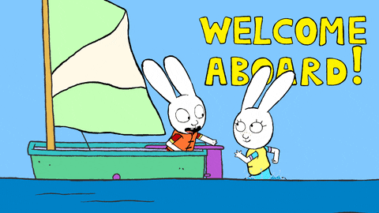
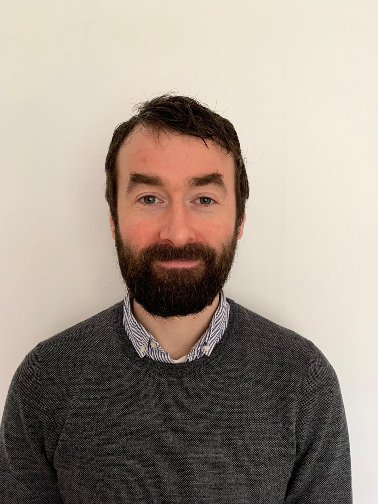
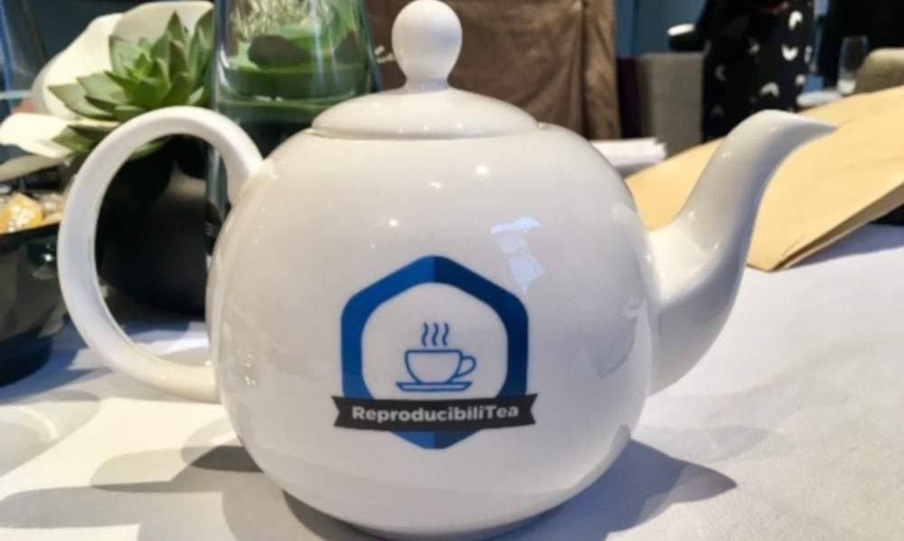
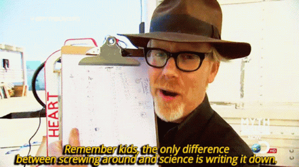
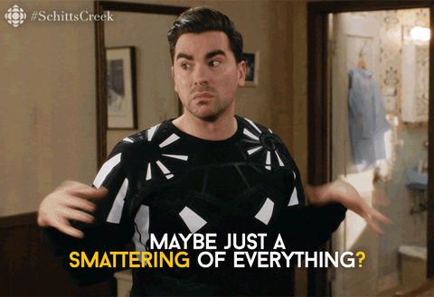

```{r setup, include=FALSE}
options(htmltools.dir.version = FALSE)
knitr::opts_chunk$set(echo = TRUE)
```

## Outline

* Who am I?
* What are Open Research Practices?
* Why are they useful for ECRs?
* What are the obstacles?
* How can we help?


```{r, out.width = "600px", echo=FALSE, fig.align='center'}
 
```

---
## Who am I?

* Thomas Pollet - Professor in Dept of Psychology.

--

* Institution Lead (IL) for the UK Reproducibility Network (www.ukrn.org)

--

* IL: 'Top Down': Senior management; I promote UKRN, and deliver training - I am independent from Local Network Lead

--

* Local Network Lead:  David Smailes (Senior Lecturer / Asst. Prof. in Psychology)

```{r, out.width = "200px", echo=FALSE, fig.align='center'}
 
```

---
## Local Network Lead

David does ‘grassroots’ open research stuff. Tries to stimulate open research practices.

For example, [ReproducibiliTea](https://reproducibilitea.org/).

```{r, out.width = "300px", echo=FALSE, fig.align='center'}
 
```

---
## What are Open Research Practices?

* An umbrella term for many practices. Often linked with other domains of 'good' research practices: Research Integrity, Research ethics, Digitisation, Research culture

--

```{r, out.width = "300px", echo=FALSE, fig.align='center'}
 
```

--

* Tend to have aims of making our work more:
    - **Accessible.** e.g., articles/books open access. Allowing others to re-use your research.
    - **Reproducible.** Being more transparent about your research process. Using tools/resources that are open access, which allow others to reproduce your findings.
    - **Replicable (?).** Increasing likelihood of someone finding the same effect.

---
## Why are these practices useful for ECRs?

* Cynically: In your self-interest you should engage with these.

* Open Research is the Future: More journals, funders, universities etc. will have requirements.

* Developing these practices and having a track record --> **Smart Move.**

```{r, out.width = "300px", echo=FALSE, fig.align='center'}
knitr::include_graphics("Cynic.gif") 
```

---
## Why are these practices useful for ECRs?

* Less cynically ... .

--

* Engaging in these practices --> ‘The Right Thing To Do’.

--

* Adopting open research practices means developing a more robust evidence base.

--

* Sharing knowledge more effectively.

--

* In certain domains, it could increase likelihood of publication, even in absence of support hypothesised effects. [Registered Reports](https://www.cos.io/initiatives/registered-reports).

--

* Working transparently: Could also protect you from criticism. (e.g.,  **Pre-registered and available analysis plan** vs. **no analysis plan**)

---
## Obstacles

* It’s overwhelming! An example:
  - Learning how to use new open source statistical software (e.g. R vs. SPSS)
  - Conducting high-powered replication
  - Write a registered report
  - Pre-register my study design and analysis
  - Post my data and code to an open repository.
  - Make a preprint and post that.
  - Publish in an unfamiliar Open Access journal.

--

All: Very true/understandable!

--

Think of it as a buffet of Open Research Practices. 

```{r, out.width = "200px", echo=FALSE, fig.align='center'}
 
```

--

Try some soon, leave some until later.

---
## Obstacles

* "My supervisor isn’t into this stuff."
  - So, how do I build this into my work?
  - How do I learn how to do this?
  - Don’t fight your supervisor; negotiate what you can build into your work. 
  
Remember the buffet!

Should be something in the buffet that appeals to them.

In terms of training/learning…

---
## How can we help?

* Get in touch!

* If you need guidance on any Open Research stuff, send David or me an [email](mailto:thomas.pollet@northumbria.ac.uk).

Probably David -- [david.smailes@northumbria.ac.uk](mailto:david.smailes@northumbria.ac.uk) !

We will do our best to help.

We might lean on the [UKRN’s](www.ukrn.org) resources/network as well.

Some dedicated resources at the library (e.g., regarding open access)

---
## Any Questions?

[http://tvpollet.github.io](http://tvpollet.github.io)

Twitter: @tvpollet

```{r, out.width = "600px", echo=FALSE, fig.align='center'}
knitr::include_graphics("https://media.giphy.com/media/3ohzdRoOp1FUYbtGDu/giphy.gif")
```

---
## Acknowledgments

* I am greatly indebted to David Smailes who provided me with a slide deck on which this is based.

* The slides were created in [RMarkdown](https://rmarkdown.rstudio.com/) with the [xaringan](https://github.com/yihui/xaringan) package.

* You for listening!

```{r, out.width = "500px", echo=FALSE, fig.align='center'}
knitr::include_graphics("https://media.giphy.com/media/10avZ0rqdGFyfu/giphy.gif")
```


---
## Some resources

* [www.ukrn.org](www.ukrn.org)
* [RepoducibiliTea](https://reproducibilitea.org/)
* [Center for Open Science](https://www.cos.io/?hsLang=en)
* [UKRI](https://www.ukri.org/about-us/policies-standards-and-data/good-research-resource-hub/open-research/)
* [Registered Reports](https://www.cos.io/initiatives/registered-reports)
